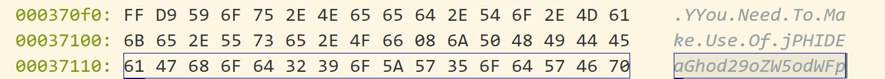
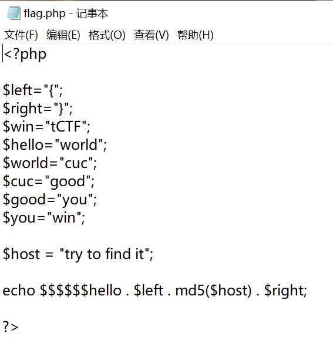
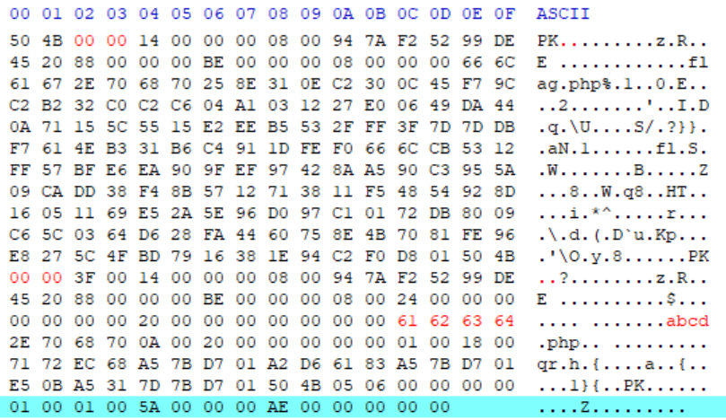

# 买宁 -- 个人技术总结报告

## 对团队的贡献：
- 前期搜集资料，选定要做的漏洞类型
- 构思图片加密的思路
- 完成第二版的图片加密，对隐藏的图片做 jphide 加密
- 编写 exp.py 和 check.py
- 创建登录页面数据库
- 题目完整攻击视频录制及剪辑
- 最后整合总的代码和大家的文档。

## 有技术含量的工作

### 图片加密

图片加密部分为本实验关键技术的第二部分。结合个人赛图片取证题的思路，在图片 this_is_aaaaaa_hint.jpg 里藏了另一张图片 Host.jpg 和一个压缩包 guess.zip。

1.	对图片 Host.jpg 采用了 jphide 加密，使用了常见的加密工具 Jphswin ，工具搜索 jphide 解密便能容易的获取，在 host.txt 中放入想要藏的信息（对 `MMT is beautiful的base64 `加密），然后利用该工具将 host.txt 藏入 Host.jpg 中，设置密码`hhhwohenhuai`，然后将该密码进行base64转换，并连通提示信息一起放在文件结尾处，如下所示： 


2.	然后将flag.php放入压缩包guess.zip，内容如下：
 
如果能顺利从 Host.jpg 获取提示信息，即可生成正确的 flag

3.	将 Host.jpg 和 guess.zip 按顺序使用命令与 this_is_aaaaaa_hint.jpg 拼接：
    ```
    Copy /b Host.jpg this_is_aaaaaa_hint.jpg this_is_aaaaaa_hint.jpg
    Copy /b guess.zip this_is_aaaaaa_hint.jpg this_is_aaaaaa_hint.jpg
    ```
4.	最后对图片末尾的zip文件信息进行修改，下图标红位置为修改处：

修改了文件的第一个 PK 头和第二个 PK 头的后两位，以及根据 zip 包压缩文件前后须保持一致的规则，对第二个名字进行修改，到这一步完成了所有的信息隐藏。

- 三个文件是拼接在一起的，由jpg格式的文件尾`FF D9`可以轻松地获取提示信息，以及根据文件格式修改好 zip 获取最终的 flag 。也可以先用 binwalk 命令分析分离得到 Host.jpg

### Check.py

编写 check.py 检查网页是否能打开以及SQL注入是否成功

### exp.py

编写 exp.py 用代码的方式获取 flag 


## 问题及解决方法：

- 问题一： `docker-compose up –d` 一键搭建环境命令运行失败
    + 解决方法： 因为之前测试过别的docker，每次重新搭建之前需要关掉之前的镜像，并修改`docker-compose.yml` 里的测试号，再重新搭建，就能搭建成功。
- 问题二：如何检查网页是否正常打开？
    + 解决方法：获取网页返回的code码，判断其是否为`200`，如果是的话，就说嘛网页可以正常打开。本次环境中有三个网页，就检查3次。
- 问题三：如何检查网页存在SQL注入？
    + 解决方法：最常用的方法就是注入`1’`，如果存在SQL注入不管是字符型注入还是数字型注入都会报错，因为引号不匹配，如果返回的信息提示里有`syntax error`，就说明我们搭建的环境里成功注入了SQL漏洞。
- 问题四：在使用MySQL创建数据库时，忘记了Root密码（真的是又坑又恼火），重装后默认之前的用户名和密码，然而俺并不记得了
    + 解决方法：最开始的报错信息是`Can't connect to MySQL server on localhost (10061)`，搜索之后发现这是因为MySQL的服务未开启，使用管理员身份打开命令行，然后运行`mysqld --install`，会提示成功开启MySQL服务
    + 尝试着重新初始化数据库，命令为`mysqld --initialize --user=root --console`，但是不能执行这条命令，原有的root用户和密码不可被覆盖，只能尝试修改密码。
    然后参照MySQL的官方文档提供的重置root密码的方法：
        * 新建一个文本文件，写入修改用户密码的SQL语句。MySQL 5.7.6及更高版本写这句：
            ```
            ALTER USER 'root'@'localhost' IDENTIFIED BY '123456';
            ```
        * 接着停掉MySQL服务，用管理员身份打开cmd，输入：`net stop mysql`
        * 再执行如下命令，应用`root_init.txt`文件进行初始化操作：
            ```
            mysqld --init-file="C:\\root_init.txt" –console
            ```
    然后我终于解决了这个问题，就可以正常连接数据库了。
- 问题五:在写EXP时如何用Python快速计算MD5值？
    + 解决方法：使用hashlib库，host_md5hash = hashlib.md5(host.encode())
    host_md5 = host_md5hash.hexdigest()
