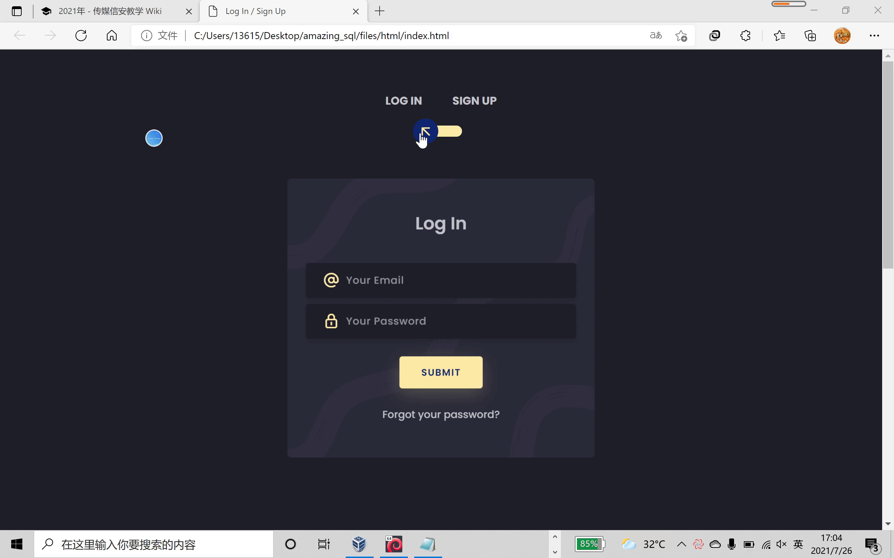

## 创新实践能力团队赛技术总结报告  
### 个人主要贡献  
* **开发注册登录界面**  
    * 设计页面样式，完成html、css代码    
     
    * 连接后端数据库，通过php代码对数据库进行查询、插入等操作，完成用户登录时前后端的数据交互  
    ```  
    <?php 

    $conn = mysqli_connect('127.0.0.1','root','root','cometosql') or die('数据库连接失败');

    $conn->set_charset('utf8');

    $name = $_POST['logname'];.

    $email = $_POST['logemail'];

    $pass = $_POST['logpass'];


    if(!empty($name)){

        $sql = "INSERT INTO users(user,pass,email)

        VALUES ('{$name}' ,'{$pass}','{$email}')";

        mysqli_query($conn,$sql) or die(mysqli_error($conn));

        echo("注册成功！");
    }

    else{
        $sql="SELECT * FROM users where email='{$email}' and pass='{$pass}'";

        $result=$conn->query($sql);

        $row = mysqli_num_rows($result);
    }

    if($row == 1){

    echo $row['user']."登陆成功!";
    }

    else{
    echo"登录失败，请重新登录！";

    }?> 
    ```  
* **开发注入界面（即个人留言界面）**  
    * 设计页面样式，完成html、css代码  
      
    * 创建sql注入时返回结果的数据库，包含5个表，其中只有一个表中含有flag,用户需注入查看表的内容寻找flag。   
    * 连接后端数据库，使用php代码（见share.php)编写堆叠注入逻辑：  
        * 在用户输入sql注入常见关键词例select、update时进行过滤，返回警告信息（个人认为算是解题的一个小难点）  
        * 限制用户注入范围，输入单个语句只能在word表中生效，所以要使用堆叠查询，即一次对数据库执行多个操作。  
* **配置nginx静态资源访问**  
下一步的思路被藏在一张图片里，用户需要先通过堆叠注入得到图片的路径，这就涉及到静态资源访问配置:  
    * 指定nginx工作目录  
    * 把希望其他用户访问到的静态资源移动到此目录下
* **Docker环境搭建**  
    * 编写Dockerfile  
    * 编写docker-compose.yml  
    * 修改镜像后封装  
    * 配置nginx.conf  
        * 指定工作目录  
        * 指定nginx启动后的默认页面为index.php  
      
* **fix it**  
    * 将禁止堆叠注入与过滤常见数据库操作语句相结合，用户无法访问含有敏感信息的表  
    ```  
    #一次只能执行一个操作
    multi_query()-->query()  

    #过滤  
    preg_match("/select|update|delete|drop|insert|where|\./i",$inject) && die('察觉到你尝试攻击,请停止sql注入');  
    ```
### 问题与解决  
* 编写php代码时总遇到语法错误  
    >其实都是很简单的问题，代码逻辑并不复杂，只是php用法不熟，goole后解决  
* 不了解网页中的静态资源访问配置
    >nginx中设置 /var/www/html为工作目录，将需要被访问到的静态资源放置在这个文件夹下，就可以通过url顺利访问。
* 交付最终搭建的漏洞环境时（break it环节），其他电脑无法访问我的主机。
    >网络问题，主机接上网线，手动配置IP地址（10.67.4.xxx），子网掩码(255.255.255.0)，域名解析服务器(202.205.16.5)。虚拟机用桥接网卡上网，进行同样的设置（配置静态IP），进入account.cuc.edu.cn连接网络后，成功解决。  
* Dockerfile与docker-compose.yml文件中语法含义不太了解  
    >参考[Dockerfile文件详解](https://www.cnblogs.com/panwenbin-logs/p/8007348.html)与[docker-compose.yml配置文件详解](https://blog.csdn.net/qq_36148847/article/details/79427878)